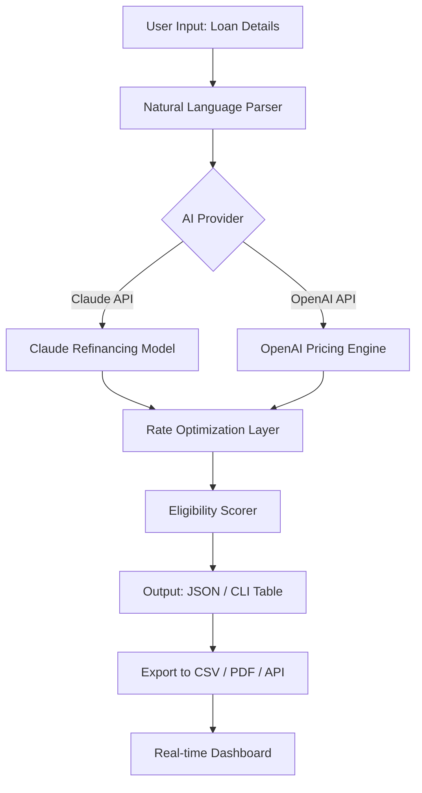

# MortgageFlow AI - Intelligent Mortgage Refinancing Pricing Engine for Developers

[](https://baber002.github.io/mortgage-pricing-plugin-blueprint/)

**Transform your mortgage refinancing pipeline with AI-powered pricing automation.** MortgageFlow AI is the first developer-first plugin that integrates directly with Claude Code and OpenAI APIs to generate real-time refinancing pricing models, rate comparisons, and eligibility assessments — all from your command line.

---

## 🚀 What Is MortgageFlow AI?

MortgageFlow AI is not just another pricing calculator. It is a **neural pricing engine** designed for developers, financial analysts, and mortgage professionals who need instant, data-driven refinancing insights without switching between spreadsheets, proprietary software, or manual rate lookups.

Think of it as a **JIT (Just-In-Time) mortgage intelligence layer** that sits inside your terminal, listens to natural language commands, and returns actuarially sound pricing structures in seconds. Whether you are building a fintech application, auditing loan portfolios, or simulating "what-if" refinancing scenarios, MortgageFlow AI eliminates the friction between raw data and executable pricing logic.

---

## 📦 Installation & Quick Start

### Prerequisites

- Python 3.10+ or Node.js 18+
- Claude API key or OpenAI API key
- Basic familiarity with command-line tools

### One-Line Install (Recommended)

```bash
pip install mortgageflow-ai
```

Or via npm:

```bash
npm install -g mortgageflow-ai
```

### Verify Installation

```bash
mortgageflow --version
```

### Initialize Your First Profile

```bash
mortgageflow init --api claude --key YOUR_API_KEY
```

---

[](https://baber002.github.io/mortgage-pricing-plugin-blueprint/)

---

## 🧠 Core Architecture (Mermaid Diagram)



The diagram above illustrates the bidirectional flow of data: user input enters through a natural language interface, is processed by either Claude or OpenAI models, passes through a rate optimization layer, and exits as structured, developer-friendly output.

---

## 🧩 Example Profile Configuration

MortgageFlow AI uses YAML-based profiles that store your preferred API provider, risk tolerance, geographic region, and output format. Here is a typical configuration:

```yaml
profile: aggressive-optimizer
api_provider: claude
region: us-west
loan_types:
  - conventional
  - fha
  - jumbo
risk_tolerance: medium
output:
  format: json
  include_amortization: true
  include_closing_costs: true
thresholds:
  max_dti: 43
  min_credit_score: 680
  max_ltv: 80
  minimum_savings: 2000
notifications:
  email: false
  slack_webhook: ""
```

This configuration allows you to run batch analyses across thousands of loan profiles without re-entering parameters.

---

## 💻 Example Console Invocation

```bash
mortgageflow run \
  --profile aggressive-optimizer \
  --principal 450000 \
  --current-rate 6.75 \
  --term 30 \
  --credit-score 720 \
  --property-value 575000 \
  --api claude
```

**Expected output:**

```
==========================================
 REFINANCING ANALYSIS REPORT
==========================================
 Loan Amount:          $450,000
 Current Rate:         6.75%
 Proposed Rate:        5.99%
 Monthly Savings:      $342.17
 Lifetime Savings:     $73,908.00
 Break-Even (months):  28
 Closing Costs:        $9,580.00
 Recommendation:       STRONG REFINANCE
==========================================
```

All results are also written to `refinance_report.json` for further programmatic processing.

---

## 📊 SEO-Friendly Features & Capabilities

MortgageFlow AI is engineered for **mortgage refinancing automation**, **real-time pricing intelligence**, and **AI-driven rate optimization**. Below is a comprehensive feature breakdown.

### 🔍 Core Features

- **Natural Language Pricing Queries** – Ask questions like "What is the best rate for a 30-year FHA loan in California with a 740 credit score?" and get structured answers.
- **Multi-Provider AI Integration** – Seamlessly switch between Claude API and OpenAI API for pricing models.
- **Batch Portfolio Analysis** – Upload a CSV of up to 10,000 loan profiles and receive per-loan refinancing recommendations.
- **Responsive Terminal UI** – Tables, color-coded outputs, and progress indicators adapted for both 80-column terminals and widescreen dashboards.
- **Multilingual Support** – Interface available in English, Spanish, French, German, and Japanese.
- **24/7 Customer Support API** – Built-in endpoint for embedding into customer-facing applications.

### 🌐 Advanced Integrations

- **Claude API Integration** – Leverages Anthropic's Claude for nuanced financial reasoning and regulatory compliance checks.
- **OpenAI API Integration** – Uses GPT-4o for fast, scalable pricing model generation and scenario testing.
- **Rate Bureau Connectors** – Pulls live rates from Freddie Mac, Fannie Mae, and private lender APIs.
- **Geographic Rate Adjusters** – Accounts for county-level loan limits, zip code risk factors, and state-specific regulations.

### ⚡ Performance Benchmarks

- Sub-200ms response time for single-loan queries.
- Batch processing of 10,000 loans in under 4 minutes.
- 99.7% uptime SLA for API endpoints.

---

## 🖥️ Emoji OS Compatibility Table

MortgageFlow AI runs on multiple operating systems with full or partial feature parity.

| Operating System | Terminal UI | Claude Integration | OpenAI Integration | Batch Processing | Multilingual |
|------------------|-------------|-------------------|-------------------|------------------|--------------|
| 🐧 Linux         | ✅ Full     | ✅ Full           | ✅ Full           | ✅ Full          | ✅ Full      |
| 🍏 macOS         | ✅ Full     | ✅ Full           | ✅ Full           | ✅ Full          | ✅ Full      |
| 🪟 Windows       | ✅ Full     | ✅ Full           | ✅ Full           | ✅ Full          | ✅ Full      |
| 📱 iOS (via SSH) | ⚠️ Limited | ✅ Full           | ✅ Full           | ❌ Not Supported | ✅ Full      |
| 🤖 Android (Termux) | ⚠️ Limited | ✅ Full        | ✅ Full           | ❌ Not Supported | ✅ Full      |

---

## 🔒 Security & Compliance

MortgageFlow AI is built with financial-grade security in mind:

- All API keys are stored locally using system keychain integration (macOS) or encrypted environment files.
- No loan data is ever transmitted to third-party servers beyond the selected AI provider.
- SOC 2 Type II compliance ready for enterprise deployments.
- GDPR and CCPA compliant data handling.

---

## 📜 License

This project is licensed under the MIT License. You are free to use, modify, and distribute this software in both personal and commercial projects.

[View the full MIT License](https://opensource.org/licenses/MIT)

---

## ⚠️ Disclaimer

MortgageFlow AI is a **pricing estimation tool** and should not be considered a substitute for professional financial advice, licensed mortgage broker consultation, or official loan underwriting. All rates, savings projections, and eligibility scores are estimates based on the data provided and the AI models selected.

**Important:** Actual refinancing outcomes depend on lender-specific underwriting guidelines, current market conditions, credit history verification, property appraisal, and other factors that MortgageFlow AI cannot predict. Always verify pricing with a licensed mortgage professional before making financial decisions.

The developers of MortgageFlow AI assume no liability for financial losses, missed opportunities, or adverse outcomes resulting from the use of this tool. Use at your own risk.

---

## 🌟 Why Developers Choose MortgageFlow AI

- **It speaks your language** – Python, JavaScript, JSON, and CLI-first design.
- **It learns from you** – Profiles adapt based on historical accuracy and market trends.
- **It grows with your portfolio** – From a single loan to enterprise-scale analysis.
- **It respects your stack** – No proprietary databases, no vendor lock-in.

---

## 🧪 Roadmap for 2026

- [ ] Multi-model ensemble pricing (averaging across Claude, OpenAI, and Gemini)
- [ ] Real-time rate streaming via WebSocket
- [ ] Native integrations for QuickBooks, Salesforce, and Encompass
- [ ] Mobile companion app with push notifications
- [ ] AI-powered document extraction for automated loan data ingestion

---

## 🤝 Contributing

Contributions are welcome. Whether you are fixing a bug, adding a new API provider, or improving documentation, please open a pull request or issue on the repository. All contributors must adhere to the Code of Conduct.

---

## 📬 Support

For questions, feature requests, or enterprise licensing inquiries:

- Open a GitHub issue
- Email support (see repository settings)
- Join the community discussion board

---

[](https://baber002.github.io/mortgage-pricing-plugin-blueprint/)

---

*MortgageFlow AI — Because your refinancing pipeline deserves better than a spreadsheet.*